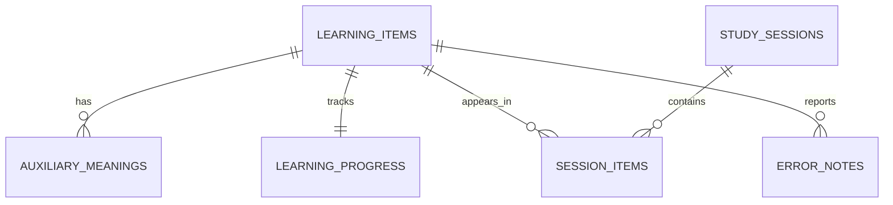

# Room 데이터 모델

상태: 확정

## 목표

- 확정된 학습·복습 상태 전이 저장
- 앱 종료 후 정확한 세션 복구
- 추천 재생성·제외 복원·기록 초기화 지원
- MVP 조회에 필요 없는 이력·추상화 제외

## 모델 원칙

- ID: 앱에서 생성한 UUID를 SQLite `TEXT`로 저장
- enum: 순서 변경에 안전하도록 이름을 `TEXT`로 저장
- 현지 날짜: `LocalDate.toEpochDay()`의 `INTEGER` 저장
- 시각: epoch milliseconds의 `INTEGER` 저장
- 외래 키 활성화, 관계 삭제는 명시된 경우만 `CASCADE`
- 콘텐츠와 사용자 진도 분리

## 관계



총 6개 테이블만 사용

## 테이블

### `learning_items`

학습 단위인 `표현 + 목표 뜻 + 문맥` 저장

| 컬럼 | 타입 | 규칙 |
|---|---|---|
| `id` | `TEXT` | PK, UUID |
| `contentKey` | `TEXT` | UNIQUE, 중복 제거용 |
| `expression` | `TEXT` | 영어 표현 |
| `normalizedExpression` | `TEXT` | 검색·중복 비교용 |
| `baseForm` | `TEXT?` | 변화형이면 기본형 |
| `itemType` | `TEXT` | `WORD`, `IDIOM`, `PHRASAL_VERB`, `TECH_TERM`, `EXPRESSION` |
| `partOfSpeech` | `TEXT` | 품사 |
| `targetMeaningKo` | `TEXT` | 목표 뜻 1개 |
| `phonetic` | `TEXT?` | 발음기호 |
| `exampleSentence` | `TEXT` | 예문 1개 |
| `exampleTranslationKo` | `TEXT` | 예문 해석 |
| `exampleTargetForm` | `TEXT` | 빈칸 정답 형태 |
| `topic` | `TEXT` | 관심 분야 |
| `difficulty` | `TEXT` | 확정 난이도 enum 이름 |
| `meaningSourceName` | `TEXT?` | 뜻 출처 |
| `meaningSourceUrl` | `TEXT?` | 뜻 출처 URL |
| `meaningLicenseName` | `TEXT?` | 라이선스 |
| `meaningLicenseUrl` | `TEXT?` | 라이선스 URL |
| `exampleSourceName` | `TEXT?` | 예문 출처 또는 생성 주체 |
| `exampleSourceUrl` | `TEXT?` | 예문 출처 URL |
| `exampleLicenseName` | `TEXT?` | 예문 라이선스 |
| `exampleLicenseUrl` | `TEXT?` | 예문 라이선스 URL |
| `generationBatchId` | `TEXT?` | 50개 생성 요청 식별자 |
| `createdAtMillis` | `INTEGER` | 생성 시각 |
| `updatedAtMillis` | `INTEGER` | 수정 시각 |

`contentKey` 기본 구성

```text
normalizedExpression + "|" + partOfSpeech + "|" + normalizedTargetMeaning
```

목표 뜻과 예문은 카드당 하나이므로 별도 테이블로 분리하지 않음

인덱스

- UNIQUE `contentKey`
- `normalizedExpression`
- `(topic, difficulty)`

### `auxiliary_meanings`

보조 뜻만 저장. 목표 뜻은 `learning_items.targetMeaningKo`

| 컬럼 | 타입 | 규칙 |
|---|---|---|
| `itemId` | `TEXT` | FK → `learning_items.id`, `CASCADE` |
| `sortOrder` | `INTEGER` | 표시 순서 |
| `meaningKo` | `TEXT` | 보조 뜻 |

PK: `(itemId, sortOrder)`

### `learning_progress`

항목별 현재 수명주기·추천 순서·복습 일정 저장

| 컬럼 | 타입 | 규칙 |
|---|---|---|
| `itemId` | `TEXT` | PK, FK → `learning_items.id`, `CASCADE` |
| `status` | `TEXT` | `QUEUED`, `LEARNING`, `REVIEWING`, `MASTERED` |
| `queueOrder` | `INTEGER?` | `QUEUED` 정렬값 |
| `intervalIndex` | `INTEGER?` | `REVIEWING`일 때 1..5 |
| `dueEpochDay` | `INTEGER?` | 다음 복습 현지 날짜 |
| `learnedEpochDay` | `INTEGER?` | 신규 학습 완료일 |
| `masteredEpochDay` | `INTEGER?` | 30일 복습 통과일 |
| `excludedAtMillis` | `INTEGER?` | null이 아니면 모든 출제·추천에서 제외 |
| `updatedAtMillis` | `INTEGER` | 변경 시각 |

제외는 수명주기와 독립된 상태. 복원 시 `excludedAtMillis = null`만 수행하여 기존 진도 보존

불변식

- `QUEUED`: `queueOrder != null`, 복습 컬럼 null
- `LEARNING`: 활성 신규 `session_items` 존재
- `REVIEWING`: `intervalIndex`와 `dueEpochDay` 존재
- `MASTERED`: `masteredEpochDay` 존재, 복습 컬럼 null
- `excludedAtMillis != null`: 상태는 유지하되 기본 조회에서 제외

인덱스

- `(status, excludedAtMillis, queueOrder)`
- `(status, excludedAtMillis, dueEpochDay, itemId)`

별도 `recommendation_queue`, `review_schedule`, `excluded_items` 테이블은 만들지 않음

### `study_sessions`

날짜별 신규·복습 세션과 연속 학습일 근거 저장

| 컬럼 | 타입 | 규칙 |
|---|---|---|
| `id` | `TEXT` | PK, UUID |
| `epochDay` | `INTEGER` | 기기 현지 날짜 |
| `type` | `TEXT` | `NEW`, `REVIEW` |
| `status` | `TEXT` | `ACTIVE`, `COMPLETED`, `EXPIRED` |
| `goalCount` | `INTEGER` | 세션 시작 시 목표 수 스냅샷 |
| `startedAtMillis` | `INTEGER` | 시작 시각 |
| `completedAtMillis` | `INTEGER?` | 완료 시각 |

UNIQUE: `(epochDay, type)`

별도 일일 성과 테이블 없이 완료된 세션 날짜로 연속 학습일 계산

- 같은 현지 날짜의 `ACTIVE` 세션만 복구
- 날짜가 달라진 `ACTIVE` 세션은 `EXPIRED`
- 만료 시 완료된 항목 전이는 유지
- 미완료 신규 항목은 `QUEUED`로 복귀
- 미완료 복습 항목은 기존 `REVIEWING` 일정 유지

### `session_items`

앱 종료 후 문제 단계와 재출제 대기열 복구

| 컬럼 | 타입 | 규칙 |
|---|---|---|
| `sessionId` | `TEXT` | FK → `study_sessions.id`, `CASCADE` |
| `itemId` | `TEXT` | FK → `learning_items.id` |
| `queueOrder` | `INTEGER` | 현재 출제 순서, 재출제 시 뒤에 새 값 부여 |
| `state` | `TEXT` | `PENDING`, `ACTIVE`, `COMPLETED`, `DEFERRED` |
| `phase` | `TEXT` | 확정된 학습 단계 enum 이름 |
| `retryPhase` | `TEXT?` | `CORRECTION` 뒤 재시작 단계 |
| `knownPath` | `INTEGER` | `안다` 검증 경로 여부 |
| `phaseFailureCount` | `INTEGER` | 현재 입력 단계 실패 수, 힌트 판정용 |
| `hadInitialReviewError` | `INTEGER` | 복습 결과 `RECOVERED` 판정용 |
| `reviewIntervalAtStart` | `INTEGER?` | 복습 시작 인덱스 스냅샷 |
| `lastSubmittedAnswer` | `TEXT?` | 오답 화면 복구용, 다음 단계에서 제거 |
| `updatedAtMillis` | `INTEGER` | 변경 시각 |

PK: `(sessionId, itemId)`

인덱스: `(sessionId, state, queueOrder)`

원시 시도 이력은 저장하지 않음. 현재 화면 복구와 최종 전이에 필요한 값만 유지

### `error_notes`

개인 베타의 뜻·예문 오류 메모

| 컬럼 | 타입 | 규칙 |
|---|---|---|
| `id` | `TEXT` | PK, UUID |
| `itemId` | `TEXT` | FK → `learning_items.id`, `CASCADE` |
| `category` | `TEXT` | `MEANING`, `EXAMPLE` |
| `note` | `TEXT` | 사용자 메모 |
| `createdAtMillis` | `INTEGER` | 작성 시각 |
| `resolvedAtMillis` | `INTEGER?` | 수정 완료 시각 |

인덱스: `(itemId, createdAtMillis)`

기술 오류 로그는 Room이 아닌 크기 제한 로컬 파일로 저장

## 핵심 조회

```text
추천 후보:
status = QUEUED AND excludedAtMillis IS NULL
ORDER BY queueOrder

예정 복습:
status = REVIEWING
AND excludedAtMillis IS NULL
AND dueEpochDay <= today
ORDER BY dueEpochDay, itemId

누적 학습 수:
status IN (REVIEWING, MASTERED)

복구 대상:
study_sessions.status = ACTIVE
```

## 트랜잭션 경계

Room `withTransaction`이 필요한 작업

1. AI 50개 배치: 항목·보조 뜻·초기 `QUEUED` 진도 전체 삽입
2. 신규 세션 시작: 잠금 재확인 → 후보 선택 → 세션·세션 항목 생성 → `LEARNING` 전환
3. 신규 항목 완료: 세션 항목 완료 → `REVIEWING` 일정 생성 → 세션 완료 여부 갱신
4. 복습 세션 시작: 현재 예정 복습을 세션 항목으로 스냅샷
5. 복습 항목 완료: 복습 결과 적용 → 세션 항목 완료 → 세션 완료 여부 갱신
6. 추천 재생성: 제외되지 않은 `QUEUED` 항목 삭제 → 새 배치 삽입
7. 학습 기록 초기화: 세션 삭제 → 모든 진도를 `QUEUED`로 초기화 → 제외 표시는 유지
8. 제외 복원: `excludedAtMillis` 제거, `QUEUED`면 새 `queueOrder` 부여
9. `나중에 다시`: 세션 항목을 `DEFERRED` → 진도를 `QUEUED`로 복귀 → 새 `queueOrder` 부여
10. 날짜 변경: 이전 `ACTIVE` 세션을 `EXPIRED` → 미완료 신규 항목을 `QUEUED`로 복귀

`이미 완전히 앎`은 `REVIEWING`, `intervalIndex = 5`, `dueEpochDay = today + 30`으로 전환

신규 세션은 모든 항목이 `COMPLETED` 또는 `DEFERRED`이면 완료. `DEFERRED`도 승인된 규칙에 따라 당일 신규 확인 수에 포함

## DataStore 경계

DataStore 저장값

- 하루 신규 목표 수
- 알림 활성 상태와 시각
- 학습 목적 원문
- 관심 분야와 비율
- 난이도와 제외 분야
- 테마
- 온보딩 완료 여부

관심 분야 비율과 제외 분야는 하나의 버전된 `RecommendationProfile` 값으로 원자적 저장

Room에 두지 않는 이유: 학습 항목과 관계없는 단일 사용자 설정이며 목록 쿼리 불필요

## 백업과 마이그레이션

- Room 스키마 버전과 JSON 백업 버전 분리
- 최초 Room 스키마 버전: 1
- Room schema export 활성화
- 모든 버전 간 명시적 migration 작성
- `fallbackToDestructiveMigration` 사용 금지
- JSON 전체 검증 후 Room 트랜잭션으로 교체
- DataStore 값도 검증 후 교체하며 실패 시 이전 스냅샷 복원
- 가져오기 실패 시 기존 Room·DataStore 상태 유지

## 확정 결정

1. `EXCLUDED`를 수명주기 enum에서 제거하고 `excludedAtMillis` 독립 상태로 변경
2. 목표 뜻·예문은 카드당 하나이므로 `learning_items`에 포함
3. 별도 추천 대기열·복습 일정·제외 테이블 없이 `learning_progress`로 통합
4. 원시 문제 시도 이력은 저장하지 않고 현재 세션 복구값만 저장
5. 모든 ID는 백업 안정성을 위해 UUID `TEXT` 사용
6. `이미 완전히 앎`은 30일 복습 단계로 이동
7. `fallbackToDestructiveMigration` 금지
8. 날짜가 바뀐 미완료 세션은 만료하고 미완료 신규 항목을 대기열로 복귀
