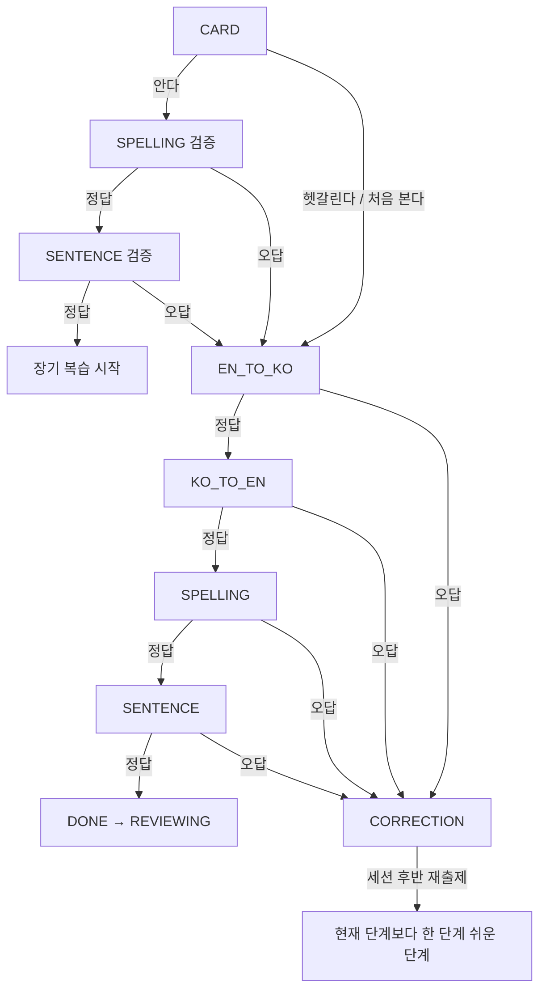

# 학습·복습 로직 설계

상태: 확정

## 목표

- 제품 기획의 학습·복습 규칙을 결정 가능한 상태 전이로 표현
- 앱 종료 후 세션 복구 가능
- 같은 입력은 같은 결과를 내도록 순수 도메인 로직 유지
- MVP에 필요 없는 점수제·자동 난이도 조절 제외

## 상태 분리

한 enum에 영속 수명주기, 현재 문제, 복습 간격을 섞지 않음

### 항목 수명주기

| 상태 | 의미 |
|---|---|
| `QUEUED` | 추천 대기열에 있으며 아직 학습하지 않음 |
| `LEARNING` | 신규 학습 시작됨 |
| `REVIEWING` | 신규 학습 완료, 복습 일정 존재 |
| `MASTERED` | 30일 복습 통과 |

`나중에 다시`는 수명주기 상태가 아님. 해당 날짜 세션에서만 제외하고 기존 상태 유지

`단어장 제외`도 수명주기 상태가 아님. 제외 시각을 별도로 저장하여 복원할 때 기존 진도 유지

### 신규 학습 단계

| 단계 | 문제 |
|---|---|
| `CARD` | 표현·뜻·예문 확인과 자기평가 |
| `EN_TO_KO` | 영어에서 한국어 목표 뜻 선택 |
| `KO_TO_EN` | 한국어 목표 뜻에서 영어 표현 선택 |
| `SPELLING` | 영어 표현 입력 |
| `SENTENCE` | 문장 빈칸 입력 |
| `CORRECTION` | 오답·정답·뜻·예문 확인 |
| `DONE` | 해당 항목의 당일 신규 학습 완료 |

현재 단계와 재출제 위치를 세션에 저장하여 앱 종료 후 복구

## 신규 학습 전이



### 일반 경로

`CARD → EN_TO_KO → KO_TO_EN → SPELLING → SENTENCE → DONE`

- 단계 정답: 다음 단계
- 단계 오답: `CORRECTION` 표시 후 세션 후반 재출제
- 재출제 단계: 오답 단계보다 한 단계 쉬운 단계
- `EN_TO_KO` 오답: 같은 `EN_TO_KO`에서 재시작
- 재출제 정답 후 원래 순서대로 진행
- `DONE`: `REVIEWING`으로 전환하고 1일 복습 예약

### `안다` 검증 경로

`CARD → SPELLING → SENTENCE`

- 둘 다 첫 시도 정답: 초기 객관식 생략, `intervalIndex = 3`, 7일 후 복습 예약
- 하나라도 오답: `EN_TO_KO`부터 일반 경로로 복귀

### 자기평가 차이

현재 기획에는 `헷갈린다`와 `처음 본다`의 단계 차이가 정의되지 않음

확정안에서는 둘 다 일반 경로 사용. 불필요한 추가 반복은 넣지 않음

## 정답 판정

영어 입력 정규화 순서

1. 앞뒤 공백 제거
2. 모든 공백 제거
3. 소문자 변환
4. 정규화된 문자열 완전 일치 비교

그 외 철자·구두점·형태 차이는 오답

철자 또는 문장 입력 2회 실패 시 첫 글자, 글자 수, 목표 뜻 힌트 표시

## 복습 간격

복습 간격 인덱스

신규 학습 세션 자체를 `학습 당일` 단계로 봄. 별도 당일 복습 일정은 만들지 않음

| 인덱스 | 간격 |
|---:|---:|
| 1 | 1일 |
| 2 | 3일 |
| 3 | 7일 |
| 4 | 14일 |
| 5 | 30일 |

신규 일반 경로 완료 시 `intervalIndex = 1`, `dueDate = 학습 현지 날짜 + 1일`

### 복습 진입 문제

- 철자 또는 문장 빈칸부터 시작
- 별도 상태 저장 없이 간격 인덱스로 교대
- 홀수 인덱스: `SPELLING`
- 짝수 인덱스: `SENTENCE`

### 복습 결과

| 결과 | 판정 | 다음 상태 |
|---|---|---|
| `PASS` | 진입 문제 첫 시도 정답 | 다음 간격으로 진행 |
| `RECOVERED` | 진입 문제 오답 후 보정 흐름 완료 | 이전 간격으로 후퇴 |
| `FAILED` | 보정 흐름의 최종 철자 재시험 실패 | 1일 간격으로 초기화 |

보정 흐름

`진입 문제 오답 → CORRECTION → EN_TO_KO → SPELLING 재시험`

간격 전이

```text
PASS:      nextIndex = currentIndex + 1
RECOVERED: nextIndex = max(1, currentIndex - 1)
FAILED:    nextIndex = 1
```

- `PASS` 후 `nextIndex <= 5`: 현지 날짜에 해당 간격을 더해 예약
- 인덱스 5에서 `PASS`: `MASTERED`
- 같은 날 보정 후 정답이어도 `RECOVERED`; 최초 오답을 지우지 않음
- 60일 확인 복습은 MVP 제외

## 밀린 복습과 신규 잠금

- 예정 복습 수: `REVIEWING`이며 `dueDate <= 오늘 현지 날짜`인 항목 수
- 21개 이상: 신규 학습 시작 잠금
- 20개 이하: 신규 학습 시작 잠금 해제
- 복습 순서: `dueDate` 오름차순, 동률은 항목 ID 오름차순
- 이미 시작한 신규 세션은 잠금 수가 변해도 중단하지 않음

## 날짜와 완료 판정

- 모든 일 단위 계산은 기기 현지 날짜 사용
- 신규 목표 수는 당일 선택해 카드를 확인한 항목 수 기준
- `안다`, `나중에 다시`도 확인한 신규 항목으로 계산
- 연속 학습일 인정: 해당 현지 날짜의 예정 복습 전부 완료 또는 신규 목표 전부 확인
- 앱 종료 시 항목별 단계, 재출제 대기열, 완료 수를 저장

## 도메인 함수 후보

구현 시 최소 순수 함수만 유지

```text
normalizeEnglish(input)
nextLearningStep(step, event, knownPath)
reviewOutcome(firstAttempt, remediation)
nextReviewSchedule(currentIndex, outcome, today)
isNewLearningLocked(dueReviewCount)
```

인터페이스·전략 패턴·점수 엔진은 실제 두 번째 구현이 생기기 전까지 추가하지 않음

## 확정 결정

1. `안다` 검증 통과 시 첫 복습 간격: 7일
2. `헷갈린다`와 `처음 본다`: 같은 일반 경로 사용
3. 복습 진입 문제: 간격 인덱스 홀짝 교대
4. 신규 세션 중 복습 적체가 21개가 되어도 진행 중 세션 유지
5. `나중에 다시`도 카드를 확인했으므로 당일 신규 목표 수에 포함
