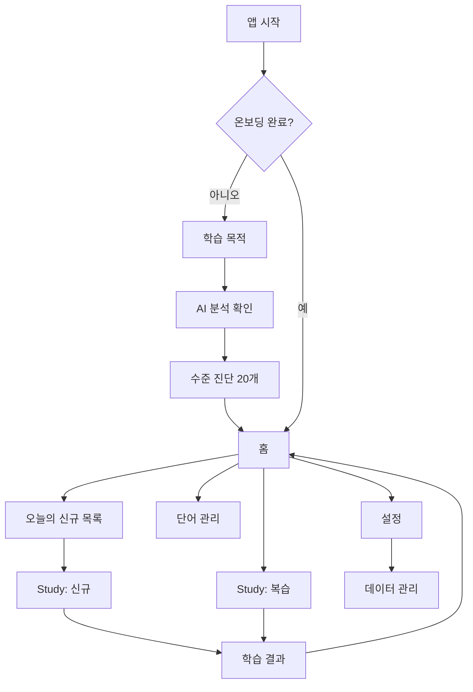

# 화면 와이어프레임과 UI 계약

상태: 확정

## 원칙

- 한 화면 한 행동
- 퀴즈 유형마다 route를 만들지 않고 하나의 `Study` 화면에서 `phase`로 전환
- 화면은 `UiState`만 표시하고 `UiEvent`만 전달
- Room·DataStore·Gemini 직접 접근 금지
- 내비게이션, 토스트·스낵바, 키보드 숨김은 일회성 `UiEffect`
- TTS 재생 요청은 ViewModel을 거쳐 플랫폼 서비스로 전달
- 로딩·빈 상태·오류·오프라인 상태를 모든 비동기 화면에서 명시

## 화면 흐름



## Route

| Route | 역할 | 인자 |
|---|---|---|
| `OnboardingPurpose` | 목적·난이도·학습량 입력 | 없음 |
| `OnboardingAnalysis` | AI 분석 결과 승인 | 없음 |
| `Diagnosis` | 20단어 진단 | 없음 |
| `Home` | 오늘 상태와 시작점 | 없음 |
| `NewOverview` | 오늘 신규 항목 빠른 훑기 | 없음 |
| `Study` | 신규·복습 세션 공통 | `sessionId` |
| `SessionResult` | 완료 결과 | `sessionId` |
| `WordManagement` | 학습·제외 항목 관리 | 없음 |
| `Settings` | 학습·알림·관심사 설정 | 없음 |
| `DataManagement` | 백업·초기화·라이선스 | 없음 |

Navigation 3의 직렬화 가능한 route 사용. 문자열 경로 조합 금지

## 공통 상태

```text
LoadState<T>
  Loading
  Content(value: T)
  Empty(message: String, actionLabel: String?)
  Error(message: String, canRetry: Boolean)
```

공통 규칙

- 최초 로딩은 중앙 진행 표시
- 버튼 처리 중 해당 버튼만 비활성화
- 전체 화면을 불필요하게 잠그지 않음
- 오류 메시지에 API 원문·키·스택 트레이스 노출 금지
- 시스템 뒤로가기로 활성 학습 세션을 삭제하지 않음

## 1. 학습 목적

```text
┌──────────────────────────┐
│ LexiLoop             1/3 │
│ 어떤 영어가 필요한가요? │
│ ┌──────────────────────┐ │
│ │ 목적을 자연어로 입력 │ │
│ └──────────────────────┘ │
│ 난이도  [초급][중급][고급]│
│ 하루 신규 [10][20][30][직접]│
│                          │
│        [목적 분석]        │
└──────────────────────────┘
```

`OnboardingUiState`

- `purposeText`, `difficulty`, `dailyNewCount`
- `isSubmitEnabled`, `isAnalyzing`, `isGenerating`, `fieldErrors`
- `diagnosisWord`, `diagnosisIndex`, `diagnosisTotal`

`OnboardingEvent`

- 목적 변경, 난이도 선택, 학습량 선택, 분석 요청

## 2. AI 분석 확인

```text
┌──────────────────────────┐
│ 분석 결과                │
│ 일상 영어           50%  │
│ 개발·업무 영어      50%  │
│ 난이도               중급 │
│ 제외 분야              없음│
│ 예시  deploy, grocery... │
│                          │
│ [다시 입력] [이대로 생성]│
└──────────────────────────┘
```

- 분석 결과는 수정 폼이 아니라 확인 화면
- 변경은 이전 화면으로 돌아가 원문 수정
- 생성 실패 시 기존 분석 유지, 재시도와 기본 단어장 선택 제공
- 생성 중 `이대로 생성` 버튼 비활성화와 진행 상태 표시

## 3. 수준 진단

```text
┌──────────────────────────┐
│ 수준 진단          7/20  │
│                          │
│         maintain         │
│                          │
│ [안다] [헷갈린다] [처음] │
└──────────────────────────┘
```

- 한 단어와 세 선택지만 표시
- 뒤로가기 시 진행 상태 유지
- 20개 완료 시 홈 이동

## 4. 홈

```text
┌──────────────────────────┐
│ 오늘도 짧게 이어가요  ⚙  │
│ 연속 4일      누적 128개 │
│                          │
│ 복습 12개   [복습 시작]  │
│ 신규 20개   [신규 시작]  │
│                          │
│ [단어 관리]              │
└──────────────────────────┘
```

`HomeUiState`

- `dueReviewCount`, `dailyNewGoal`, `availableNewCount`
- `streakDays`, `learnedTotal`
- `newStudyLocked`, `lockReason`
- `activeSessionType`, `activeSessionId`, `isOffline`
- `newItems`: 오늘의 신규 목록 `LoadState<List<Pair<String, String>>>`

규칙

- 복습 21개 이상이면 신규 버튼 비활성화와 이유 표시
- 활성 세션이 있으면 시작 대신 `이어서 하기`
- 신규 후보 부족 시 보충 생성 제안만 표시, 자동 호출 금지

## 5. 오늘의 신규 목록

```text
┌──────────────────────────┐
│ 오늘의 단어        20개  │
│ deploy       배포하다    │
│ grocery      식료품      │
│ maintain     유지하다    │
│ ...                      │
│                          │
│        [학습 시작]        │
└──────────────────────────┘
```

- 표현과 목표 뜻만 표시
- 목록 확인만으로 진도 변경 없음
- 시작 시 세션 생성 후 `Study` 이동

## 6. Study 공통 화면

```text
┌──────────────────────────┐
│ 신규 학습          8/20  │
│ ━━━━━━━━━░░░░░░░░░░░░░  │
│                          │
│          deploy      🔊  │
│       /dɪˈplɔɪ/          │
│                          │
│        단계별 콘텐츠      │
│                          │
│        단계별 행동        │
└──────────────────────────┘
```

`StudyUiState`

- `sessionId`, `sessionType`, `completedCount`, `totalCount`
- `itemId`, `expression`, `phonetic`, `targetMeaningKo`
- `auxiliaryMeanings`, `exampleSentence`, `exampleTranslationKo`
- `phase`, `phaseContent`, `answerText`, `hint`, `feedback`
- `canSubmit`, `isSubmitting`, `canGoBack`
- `isLoading`

`StudyEvent`

- 자기평가 선택
- 객관식 선택
- 입력 변경·제출
- 힌트 요청
- 다음
- 발음 다시 듣기
- `이미 완전히 앎`, `나중에 다시`, `단어장 제외`
- 오류 메모 작성

`StudyUiEffect`

- 키보드 표시·숨김
- 정답 후 700ms 자동 진행
- TTS 재생
- 세션 결과 이동
- 사용자 메시지

단계별 표시

| `phase` | 중앙 콘텐츠 | 하단 행동 |
|---|---|---|
| `PREVIEW` | 뜻·품사·예문 | 안다·헷갈린다·처음 본다 |
| `EN_TO_KO_CHOICE` | 영어 표현 | 한국어 선택지 4개 |
| `KO_TO_EN_CHOICE` | 한국어 뜻 | 영어 선택지 4개 |
| `SPELLING` | 한국어 뜻·힌트 | 영어 입력·확인 |
| `SENTENCE` | 빈칸 문장·해석 | 영어 입력·확인 |
| `CORRECTION` | 입력·정답·뜻·예문 | 다음 |

## 7. 학습 결과

```text
┌──────────────────────────┐
│ 오늘 학습 완료           │
│ 신규 확인          20개  │
│ 복습 완료           0개  │
│                          │
│          [홈으로]         │
└──────────────────────────┘
```

- 정답률·점수·과도한 축하 애니메이션 없음
- 세션 종류에 맞는 완료 수만 강조

## 8. 단어 관리

- 검색
- 상태 필터: 대기·학습·복습·장기 기억·제외
- 항목 상세에서 뜻·예문 오류 메모
- 제외 복원
- 직접 진도 변경은 `이미 완전히 앎`만 허용

## 9. 설정

- 하루 신규 수
- 알림 활성·시각
- 관심사·난이도 변경
- 추천 대기열 재생성
- 테마: 시스템·밝게·어둡게
- 데이터 관리
- 오픈 데이터 라이선스

설정 저장은 즉시 반영. 파괴적 작업만 확인 다이얼로그 사용

## 10. 데이터 관리

- JSON 내보내기
- JSON 가져오기
- 학습 기록 초기화
- 추천 단어장 재생성
- 제외 단어 복원
- 전체 데이터 삭제
- 오류 로그 내보내기

파괴적 확인 문구는 영향을 구체적으로 설명. 확인 버튼은 작업명 사용

## ViewModel 소유권

| ViewModel | 소유 화면 |
|---|---|
| `OnboardingViewModel` | 목적, 분석 확인, 진단 |
| `HomeViewModel` | 홈, 신규 목록 |
| `StudyViewModel` | Study, 결과 |
| `WordManagementViewModel` | 단어 관리 |
| `SettingsViewModel` | 설정, 데이터 관리 |

ViewModel은 Codex 소유. Compose 화면·컴포넌트·테마·Preview는 Claude 소유

## 접근성 완료 조건

- 모든 아이콘 버튼에 content description
- 최소 터치 영역 48dp
- 시스템 글자 200%에서 핵심 행동 접근 가능
- 정답·오답을 색상 외 텍스트·아이콘으로 구분
- 진행률에 현재·전체 의미 제공
- TalkBack 순서가 시각 순서와 일치
- 입력 오류를 포커스와 메시지로 안내
- 애니메이션 제거 설정 존중
